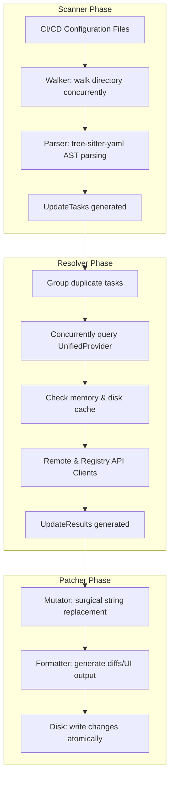

# Pinner: High-Level Architecture & Domain Overview

`pinner` is a high-performance Rust CLI tool that automates the security best practice of pinning mutable dependency tags (like `@v1` or `:latest`) to immutable references (SHA-1 hashes or digest hashes) in CI/CD workflow files. This mitigates supply chain risks (like tag-jacking).

---

## Architectural Pipeline (Domain-Driven)

The system is designed as a strict, decoupled pipeline consisting of three stages: **Scanner**, **Resolver**, and **Patcher**.



---

## Core Domain Models

These models represent the pure domain of the project and are decoupled from side-effects:

*   **`DependencyName`** (`src/core/dependency.rs`): Represents the repository or image namespace (e.g., `actions/checkout` or `library/ubuntu`).
*   **`DependencyRef`** (`src/core/dependency.rs`): Represents an immutable commit SHA-1 or a container registry image digest (sha256).
*   **`CiProvider`** (`src/core/dependency.rs`): Enum for CI platforms (`GitHub`, `GitLab`, `Forgejo`, `Bitbucket`, `CircleCI`, `AzureDevOps`, etc.).
*   **`UpdateTask`** (`src/core/update.rs`): Extracted location containing file path, byte offsets (`start`, `end`), line/column numbers, current tag, trailing comments, CI provider, and the matching YAML key (`uses`, `image`, etc.).
*   **`UpdateResult`** (`src/core/update.rs`): Struct containing the original task, the resolved immutable `DependencyRef` (SHA), and the new version tag (to be put in comments).

---

## Directory Structure Map

Here is a map of the `src/` directory to understand where different components reside:

```
src/
├── main.rs            # CLI Entry Point: Parses options and invokes commands.
├── cli.rs             # CLI Configuration: Configures clap commands, arguments, and strategies.
├── lib.rs             # Library Entry Point: Orchestrates the scan -> resolve -> patch pipeline.
├── error.rs           # Error Handling: Defines custom PinnerError types.
├── config.rs          # Config Loader: Parses and manages project configuration (.pinner.toml).
├── core/              # Domain Layer: Pure logic and core domain structures.
│   ├── mod.rs
│   ├── dependency.rs  # Domain types for dependencies, references, and CI providers.
│   └── update.rs      # Structures representing scan/resolution targets.
├── scanner/           # Scanning Layer: Traverses directories and parses syntax trees.
│   ├── mod.rs
│   ├── walker.rs      # Concurrent file system traversal (using walkdir/ignore/tokio).
│   └── parser.rs      # AST YAML parsing using tree-sitter-yaml.
├── resolver/          # Resolution Layer: Queries remote APIs to translate tags to SHAs.
│   ├── mod.rs
│   ├── provider.rs    # Core traits (RemoteProvider, RegistryProvider) & Cache Decorator.
│   ├── unified.rs     # UnifiedProvider that chooses the client to call.
│   ├── github.rs      # GitHub API client.
│   ├── gitlab.rs      # GitLab API client.
│   ├── bitbucket.rs   # Bitbucket API client.
│   ├── azure.rs       # Azure DevOps/Pipelines template/task resolver.
│   ├── forgejo.rs     # Forgejo/Gitea API client.
│   └── registry.rs    # OCI container registry client for fetching digests.
└── patcher/           # Patching Layer: Modifies source files and formats output.
    ├── mod.rs
    ├── mutator.rs     # Surgical byte-offset replacements on file contents.
    ├── formatter.rs   # Console diff rendering and status outputs.
    ├── disk.rs        # Safe file reading/writing transactions.
    └── ui.rs          # Progress bars and CLI user interaction.
```

---

## Pipeline Execution Flow

When a command like `pinner pin` or `pinner upgrade` runs:

1.  **Initialization**: `main.rs` processes parameters. It loads settings from `.pinner.toml` if available via `config.rs`.
2.  **Scanning**: `walker.rs` concurrently searches the targeted workflow paths. For each matching file, `parser.rs` executes a Tree-Sitter query on the YAML AST to find all dependency key-value pairs (e.g. `uses: actions/checkout@v3`), yielding a list of `UpdateTask`s.
3.  **Resolution**: The `Resolver` (`resolver/unified.rs`) groups `UpdateTask`s by their action name/tag to avoid redundant HTTP requests. Tasks are resolved concurrently (governed by the `concurrency` setting) via `UnifiedProvider`, which chooses the correct platform provider (e.g., `ReqwestGithubProvider` for GitHub Actions, or `RegistryProvider` for container images). Responses are cached in-memory and on disk to speed up subsequent executions.
4.  **Patching**: The `apply_update` function in `patcher/mutator.rs` updates the content string at the exact offsets of the task. If a dry run is specified, `patcher/formatter.rs` prints a diff. Otherwise, `patcher/disk.rs` writes the modifications back to disk.
